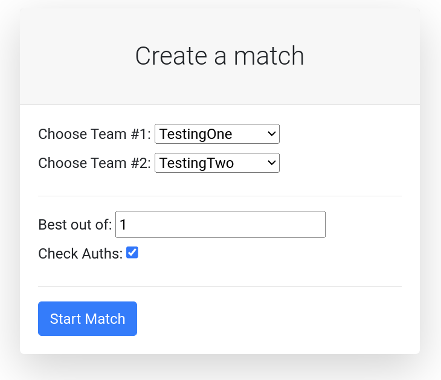
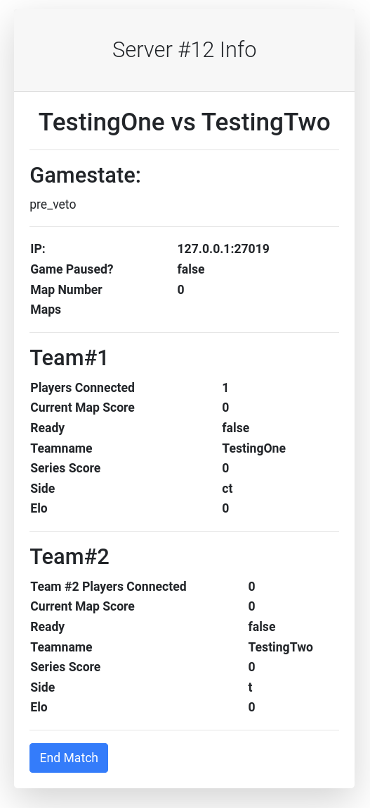

# CSGO Tournament Manager

## Status

The software has been developed for the airlan21 (25.06.2021). A small csgo tournament organized for
team-building by robo4you.at. It was also used at the airlan23 winter (07.01.2023).

**Currently, it is being updated and rewritten** for the 'airLAN23' which will take place in around 'Pfingsten' 2023 (
27.05.2023 - 29.05.2023).

**This software is still more in development than it is production ready**

## What does this software do?

It manages a number of get5 servers for small to medium lan parties. E.g. the webinterface (and the telegram bot) lets
you define new matches
by selecting players and creating teams. A new get5 server will then be started in a docker container and the match
config file will be transferred and loaded to the csgo server. It also displays some basic statistics about the servers.

### Create matches in the webinterface

[]()

### Watch the status of matches/ stop them

[]()

## How to use this software

### 1. Create csgo docker container

+ Go to the folder `get5_image` and run the `build_image.sh` script.
+ This will download the csgo server and automatically install get5. (this step may take some time)

### 2. Create Teams and GSLT file

+ Edit the `teams.json` file to include all your teams and players. This file will be mounted in the dockerfile.
+ Edit the `gslt.json` file and include all your GSLT tokens in a list like: `["TOKEN1", "TOKEN2"]`. If you plan on only
  using the servers in a LAN setting, you can simply create the file and leave the list empty (like: `[]`) and then the
  server manager will start the CSGO servers without a GSLT Token. (More information about GSLT
  Tokens: https://developer.valvesoftware.com/wiki/Counter-Strike:_Global_Offensive_Dedicated_Servers)
+ Create a postgres.env file with the following content:
  ```
  POSTGRES_USER=postgres
  POSTGRES_PASSWORD=pass
  POSTGRES_DB=postgres
  ```

### 3. Telegram BOT

+ Create .env file in the folder `telegram_bot/.env`
+ Fill it with the following content:
  ```env
  BOT_TOKEN=your_token_here
  CHAT_IDS="chat_id_1,chat_id_2..."
  ```
+ The first line is the telegram bot token of your bot. The second line specifies who has access to the bot and can send
  messages/ commands to it. If you are not sure what your chat_id is, then leave the field empty for the time being and
  run
  the bot only with the bot token. Then add your bot and type `/help` in the chat. Look at the log output of the
  software, and you will see your chat_id printed there.
+ Start group phase matchmaking using the command ```/startMatchmaking```

### 4. Start the software

+ Then start the server like: `docker-compose up --build`
+ Goto `http://127.0.0.1` and create matches.
+ The match will be started in a docker container and be visible in the `/status` page.

### 5. Connecting to the server

(Note connecting with `127.0.0.1:port` does not work, you need your PCs local IP (like 192.168.x.x or 10.x.x.x etc.) or
that of a VPN network)

+ Connect to the server, on the ip shown in the webinterface/ on telegram
+ Webinterface: Public Webinterface containing stats is available at: /public/stats
+ Admin webinterface is available at: /auth/login (login there and get redirected to the admin webinterface)

### ELO

Currently, an ELO rating system for teams is being implemented.

## Multiple Game Hosts (still in development)

TODO

## Securing the API

+ `ACCESS_SECRET_KEY`="this_is_not_a_secret": Should be a random generated secret like: `openssl rand -hex 32`
+ `API_USERNAME`="API": The username that is used in the background for API requests.
+ `ADMIN_PASSWORD`="admin": The password for the admin user in the webinterface (login at: `/auth/login`)
+ `HTTP_PROTOCOL`="http": The protocol used to connect to the api
+ `RCON_PASSWORD`="pass": The password for the rcon connections to the csgo servers.
+ `GOTV_PASSWORD`="pass": The password for the GOTV connections to the csgo servers.
+ `POSTGRES_DB`="postgres": The postgres database name.
+ `POSTGRES_DB_HOST`="db": Hostname/ IP of the database.
+ `POSTGRES_DB_PORT`="5432": The port of the database.
+ `POSTGRES_USER`="postgres": The username for the database connection.
+ `POSTGRES_PASSWORD`="pass": The password for the database connection.

If the ENV variables here are changed, you will also need to set them in the worker instances.

Note: Most of these security measures only make sense if you also use https. So putting the software behind a haproxy
etc. will be necessary.

# Major TOODS

+ refactor backend structure, split functionality into different services, e.g. stats collecting, match management etc.
+ clearer separation between master and slaves, maybe only management instance is the real "master" and all other
  servers only host games and provide nothing else
+ improve matchmaking algorithm and document it better/ at all
+ improve api security

# Banned Players

| SteamID             | Reason                              |
|---------------------|-------------------------------------|
| STEAM_0:1:148684053 | Cheating during airlan21 (wallhack) |
| STEAM_0:1:159656029 | Cheating during airlan21 (wallhack) |

# Useful commands

```bash
docker-compose -f docker-compose-webserver.yml up --build db adminer redis
docker-compose -f docker-compose-webserver.yml up --build csgo_manager
docker-compose -f docker-compose-webserver.yml up --build matchmaker
docker-compose -f docker-compose-worker.yml up --build csgo_worker
```
